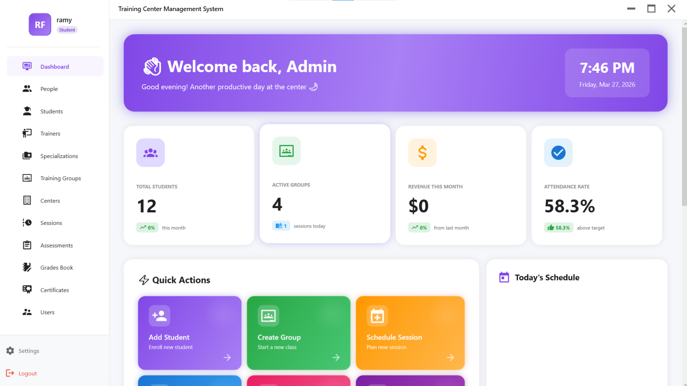
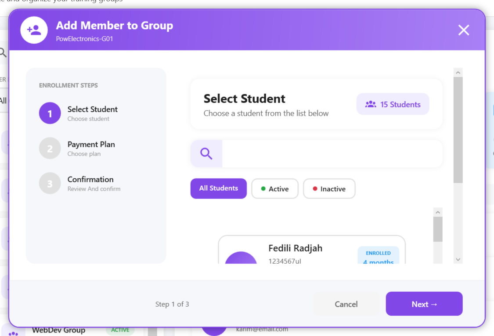
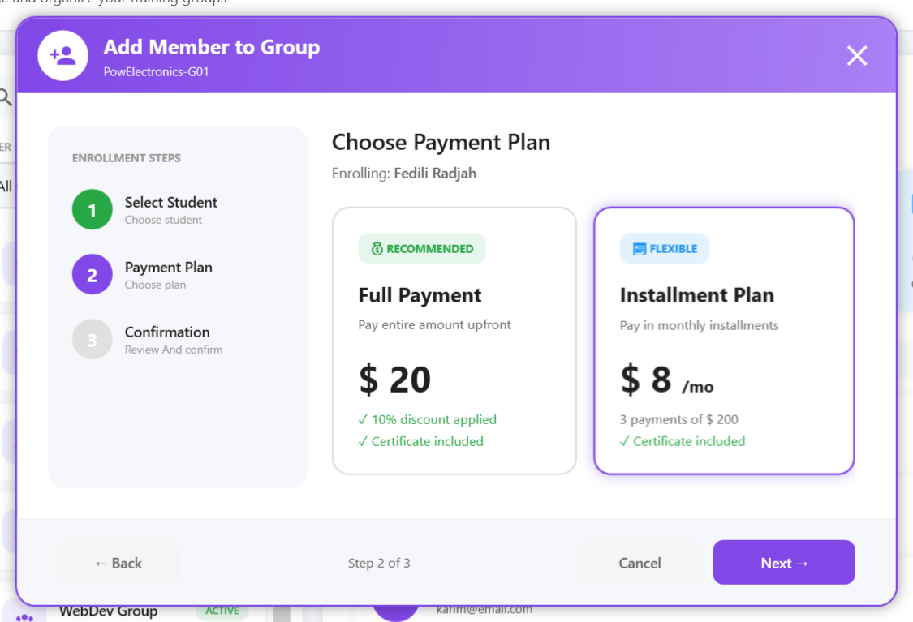
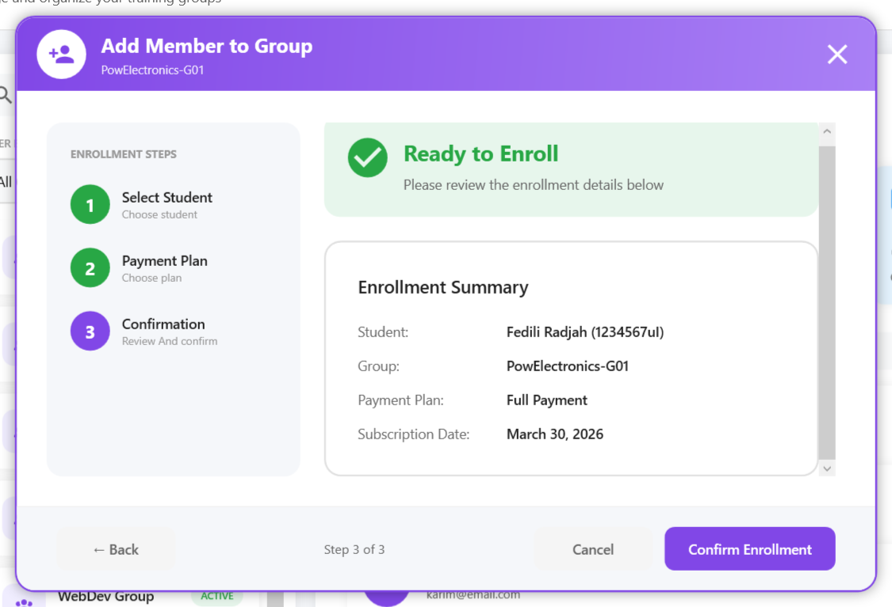

<div align="center">

<br/>

```
                        ████████╗██████╗  █████╗ ██╗███╗   ██╗██╗███╗   ██╗ ██████╗
                        ╚══██╔══╝██╔══██╗██╔══██╗██║████╗  ██║██║████╗  ██║██╔════╝
                            ██║   ██████╔╝███████║██║██╔██╗ ██║██║██╔██╗ ██║██║  ███╗
                            ██║   ██╔══██╗██╔══██║██║██║╚██╗██║██║██║╚██╗██║██║   ██║
                            ██║   ██║  ██║██║  ██║██║██║ ╚████║██║██║ ╚████║╚██████╔╝
                           ╚═╝   ╚═╝  ╚═╝╚═╝  ╚═╝╚═╝╚═╝  ╚═══╝╚═╝╚═╝  ╚═══╝ ╚═════╝
                              C E N T E R  M A N A G E M E N T
```

# 🎓 Training Center Management System

**A polished desktop application built for training centers and schools —
manage students, groups, enrollments, and payment plans with ease.**

<br/>



[](https://dotnet.microsoft.com/)
[](https://dotnet.microsoft.com/)
[](https://www.microsoft.com/en-us/sql-server)
[](LICENSE)
[]()

<br/>

</div>

---

## 📌 Overview

**Training Center Management System** is a fully-featured Windows desktop application built with **WPF and C#**, purpose-built for training schools and educational centers. It covers the full student lifecycle — from first enrollment to final payment — inside a clean, modern interface that staff can learn in minutes.

Whether you're running a small coding bootcamp or a multi-group professional training center, this system gives you the tools to stay organized and professional.

---

## 🖼️ UI Preview

<div align="center">

| 🔍 Select Student | 💳 Choose Payment Plan | ✅ Confirm Enrollment |
|:-:|:-:|:-:|
| Search & pick a student | Full payment or installments | Review before confirming |
|  |  |  |

> 💡 *Replace placeholders above with real screenshots for best results on GitHub.*

</div>

---

## ✨ Core Features

### 👥 Group & Member Management
- Create and organize training groups (e.g. *AI Fundamentals — Group A*)
- Assign students to groups and track all memberships
- View group composition at a glance with student cards showing name, number, and initials avatar
- Manage multiple groups simultaneously across different courses or levels

### 🎓 Student Enrollment Flow
A clean **3-step guided wizard** for enrolling a student into any group:

```
┌─────────────────┐     ┌─────────────────┐     ┌─────────────────┐
│   STEP 1        │────▶│   STEP 2        │────▶│   STEP 3        │
│ Select Student  │     │  Payment Plan   │     │  Confirmation   │
│                 │     │                 │     │                 │
│ Search by name  │     │ Full or monthly │     │ Review summary  │
│ or student ID   │     │ installments    │     │ & confirm       │
└─────────────────┘     └─────────────────┘     └─────────────────┘
```

- Real-time student search by name or student number
- Visual step indicators showing current progress
- Back/Next navigation with state preserved between steps
- Full enrollment summary before any data is saved

### 💳 Payment Plans
Two flexible options tailored to each student's situation:

| Plan | Description | Perks |
|---|---|---|
| 💰 **Full Payment** | Entire course fee paid upfront | 10% discount + certificate included |
| 📅 **Installment Plan** | Split into monthly payments | Flexible schedule + certificate included |

- Prices displayed dynamically per group/course
- Subscription date automatically recorded on confirmation
- Plan details carried through and shown in the final enrollment summary

### 🎨 Modern Desktop UI
- Rounded windows with drop shadows and transparency effects
- Purple-accented design system (`#8147E7`) with consistent visual language
- Hover effects, smooth card interactions, and step progress indicators
- Fully styled with WPF `ResourceDictionary` — easy to theme or rebrand

---

## 🏗️ Tech Stack

| | Technology | Purpose |
|---|---|---|
| 🖥️ | **WPF (.NET)** | Desktop UI framework |
| 💻 | **C#** | Application logic & backend |
| 🗄️ | **SQL Server** | Relational database |
| 🎨 | **MahApps.Metro** | Modern UI controls & icon packs |
| 🏛️ | **MVVM Pattern** | Clean separation of UI and logic |
| 📦 | **ResourceDictionary** | Global styles, brushes & themes |

---

## 📁 Project Structure

```
TrainingManagementSystem/           # Root Folder
│
├── TrainingManagement.sln          # SINGLE Solution file for all 4 projects
├── .gitignore                      # Updated to hide bin/obj/generated files
├── README.md                       # Main documentation with images
│
├── images/                         # Project Screenshots
│   ├── dashboard.png
│   └── assessments.png
│
├── TrainingCenter-UI/              # WPF Project (Renamed for clarity)
│   ├── App.xaml
│   ├── MainWindow.xaml
│   ├── Converters/
│   ├── Helpers/
│   ├── UserControls/               # Clean: No .g.cs files here!
│   └── Views/
│
├── TrainingCenter-BusinessLayer/   # Logic Layer
│   ├── Activity.cs
│   ├── Student.cs
│   └── ...
│
├── TrainingCenter-DataAccessLayer/ # Data Layer
│   ├── clsActivity.cs
│   ├── DataBaseSettings.cs
│   └── ...
│
└── TrainingCenter-Entities/        # DTOs
    ├── ActivityDTO.cs
    ├── StudentDTO.cs
    └── ...
```

---

## ⚙️ Getting Started

### Prerequisites

- [Visual Studio 2022](https://visualstudio.microsoft.com/) with the **.NET Desktop Development** workload
- [.NET 6 SDK](https://dotnet.microsoft.com/download) or higher
- [SQL Server](https://www.microsoft.com/en-us/sql-server/sql-server-downloads) (Express edition is fine)

### Setup

**1. Clone the repository**
```bash
git clone https://github.com/your-username/training-center.git
cd training-center
```

**2. Create the database**
```bash
# Run the setup script against your SQL Server instance
sqlcmd -S YOUR_SERVER_NAME -i Database/setup.sql
```

**3. Update the connection string**

In `App.config`, set your SQL Server details:
```xml
<connectionStrings>
  <add name="TrainingCenterDB"
       connectionString="Server=YOUR_SERVER;Database=TrainingCenterDB;Trusted_Connection=True;"
       providerName="System.Data.SqlClient"/>
</connectionStrings>
```

**4. Build & Run**

Open `TrainningCenter.sln` in Visual Studio → press **F5**, or:
```bash
dotnet build
dotnet run
```

---

## 🗄️ Database Schema

```sql
-- Core tables
Students        (StudentID, FullName, StudentNumber, ...)
Groups          (GroupID, GroupName, CourseName, Schedule, ...)
GroupMembers    (MemberID, GroupID, StudentID, EnrollmentDate)
Subscriptions   (SubID, MemberID, PlanType, TotalAmount, StartDate)
Payments        (PaymentID, SubID, Amount, DueDate, PaidDate, Status)
```

---

## 🗺️ Roadmap

- [ ] 📊 Dashboard with enrollment stats & revenue overview
- [ ] 🖨️ PDF export for receipts and enrollment certificates
- [ ] 📧 Payment reminder notifications
- [ ] 🌍 Multi-language support (Arabic / French / English)
- [ ] 🔐 Role-based login (Admin / Staff)
- [ ] ☁️ Backup & restore to cloud storage

---

## 🤝 Contributing

Pull requests are welcome! To contribute:

```bash
# 1. Fork the repo & clone it
git clone https://github.com/your-username/training-center.git

# 2. Create a feature branch
git checkout -b feature/your-feature-name

# 3. Commit with a clear message
git commit -m "feat: describe what you added"

# 4. Push and open a Pull Request
git push origin feature/your-feature-name
```

---

## 👤 Author

<div align="center">

**Built with 💜 by [Fedili Rajeh](https://github.com/rajehfed)**

[](https://github.com/your-username)
[](https://linkedin.com/in/your-profile)

<br/>

*If this project was useful or inspiring, a ⭐ star means a lot — thank you!*

</div>

---

## 📄 License

This project is licensed under the **MIT License** — see the [LICENSE](LICENSE) file for details.
